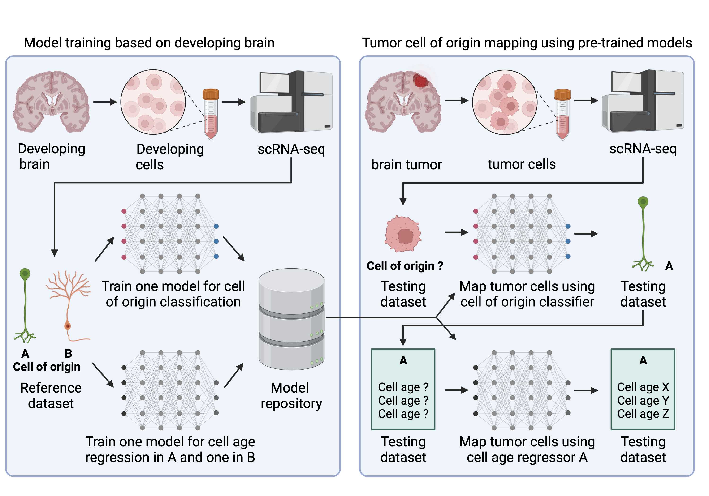

# COORS
**COORS** (**C**ell **O**f **OR**igin like Cell**S**) is a computational tool trained on developmental human brain single-cell datasets, enabling annotation of developmental-like cell states in brain tumor cells. COORS can be applied to various brain cancer datasets, including medulloblastoma and glioma, to uncover developmental-like cells and potential therapeutic targets.


## Model Description
COORS uses cell-type transcriptional annotation using machine-learned neural network models (NNMs). COORS NNMs are trained from  previously published scRNA-seq developing human brain datasets (totaling ~1M cells), such as developing human neocortical and cerebellum scRNA-seq data.



The overall workflow of COORS consists of two steps. In the initial step, we train neural network models for cell of origin classification and cell age regression using developing brain scRNA-seq datasets. Assuming we have reference data with two cell origins, A and B, we train a neural network-based cell of origin classifier using this reference data, saving the model in our repository. Concurrently, we train two neural network-based cell age regressors, one for cell origin A and another for cell origin B, also saving these trained models in the repository.  

In the second step, we map scRNA-seq tumor cells to developing healthy brain cells by using the pre-trained models. We predict the cell of origin for the testing dataset using the pre-trained cell of origin classifier. For each cell of origin, we further predict cell age using the corresponding pre-trained cell age regressor. Additionally, we conduct **SH**apley **A**dditive ex**P**lanations (**SHAP**) analysis to extract essential features from our machine-learning neural network models, identifying tumor-specific developmental-like gene markers for each cell type and age within our training datasets.

## Application
### nn_classifier.py  
- This Python script loads one **reference** dataset and one **test** dataset both provided by the user.  
- The reference dataset `[ref_name]` should be in `[ref_directory]`. Same for the test dataset.  
- The reference cell-type **column name** needs to be provided with `[ref_class_col]` (e.g., CellType).  
- To be flexible, the script _optionally_ preprocesses both datasets by `--normalize_ref` and `--normalize_test`, which is up to the user depending on whether the provided data have already been preprocessed.  
- The reference **_marker genes_** can be _optionally_ provided with `--marker [marker_filename]`.  
- Overlapped genes are selected and a neural network model is trained as a cell-type classifier based on the reference dataset.  
- Then the model predicts the cell-type probabilities and extracts features of the test dataset.  
- At last, the model is _optionally_ evaluated by `--shap` analysis with samples from the test dataset.  

**Usage**
```
$ python nn_classifier.py [ref_name] [ref_directory] [ref_class_col] [test_name] [test_directory] --marker [marker_filename] --shap --normalize_ref --normalize_test
```
  
**Equivalently**  
```
$ python nn_classifier.py [ref_name] [ref_directory] [ref_class_col] [test_name] [test_directory] -m [marker_filename] -s -r -t
```

Arguments in `[]` should be replaced with specific values.  
  
**Example 1:** Using **cerebellum** as reference and **medulloblastoma** as test, **_with_** preprocessing needed, **_with_** reference marker genes provided, **_running_** `SHAP`
```
$ python nn_classifier.py cerebellum cerebellum CellType medulloblastoma medulloblastoma -m CellTypeMarker_DevelopingHumanData.xlsx -s -r -t
```
  
**Example 2:** Using **codex** as reference and **glioma** as test, **_with_** preprocessing needed, **_with_** reference marker genes provided, **_not running_** `SHAP`
```
$ python nn_classifier.py codex codex CellType glioma glioma -m codex_cluster_markers.xlsx -r -t
```
  
**Example 3:** Using **bhaduri** as reference and **DIPG** as test, **_with_** preprocessing needed, **_without_** reference marker genes, **_running_** `SHAP`
```
$ python nn_classifier.py bhaduri bhaduri CellType DIPG DIPG -s -r -t
```
  
### Note  
  
**Sparse** or **dense** input
- nn_classifier.py accepts both **sparse** and **dense** scRNA-seq datasets as input.  
  
**Filetype** and **filename**
- nn_classifier.py accepts **.h5ad** file. `[ref_directory]` should contain **adata.h5ad** as reference. Same for `[test_directory]`.  
- To be flexible, nn_classifier.py also accepts **.mtx** file. In this case, `[ref_directory]` should contain **genes.tsv**, **barcodes.tsv**, and **matrix.mtx** as reference. Same for `[test_directory]`.  
  
**Metadata**  
- If **.mtx** is provided as reference, `[ref_directory]` should also contain **meta.tsv**, **meta.csv**, or **meta.xlsx** as metadata.
  
_Optional_ **marker genes**  
- If provided, `[ref_directory]` should contain it. Filetype should be **.tsv**, **.csv**, or **.xlsx**. The column name of gene symbols should be **Gene**.  
  
**Column separator**  
- All **.tsv** files should use `\t` as the separator.  
- All **.csv** files should use `,` as the separator.  
  
---
### age_predictor_fit.py
- This Python script trains a series of models for cell age regression.  
- For each cell of origin in the **reference** dataset, one cell age regressor is trained and saved.  
  
**Usage**
```
$ python age_predictor_fit.py [ref_name] [ref_directory] [ref_class_col] [ref_age_col] [test_name] [test_directory]
```
  
**Example:** Using **cerebellum** as reference and **medulloblastoma** as test  
```
$ python age_predictor_fit.py cerebellum cerebellum CellType age medulloblastoma medulloblastoma
```
  
### Note  
**Raw** input  
- The input **reference** data should be **raw read counts** as it will be preprocessed separately grouped by `[ref_class_col]`.  
  
---  
### age_predictor_transform.py
  
## Installation
COORS is implemented in `Python 3.7.3`. 
Install core packages with specific versions:
```
$ pip install tensorflow==1.13.1
$ pip install keras==2.2.4
```

Install other necessary packages:
```
$ pip install scanpy
$ pip install scipy
$ pip install scikit-learn
$ pip install joblib
$ pip install shap
$ pip install openpyxl
```
